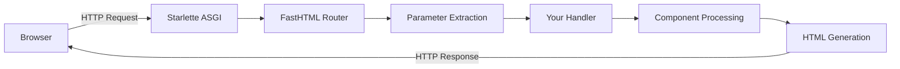
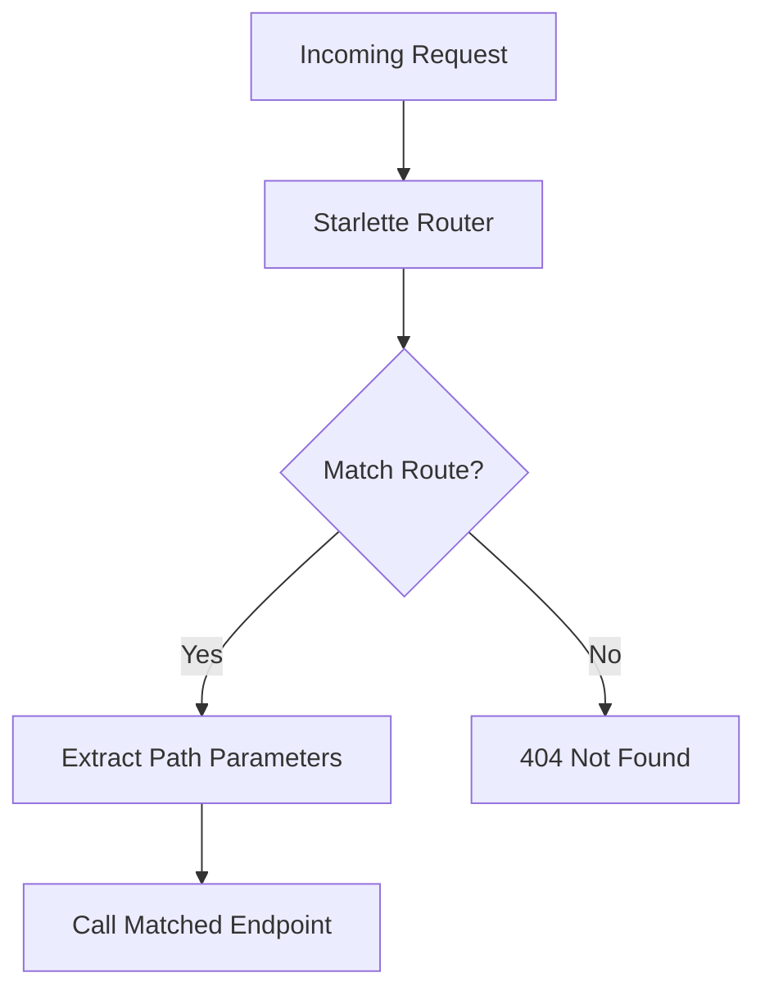
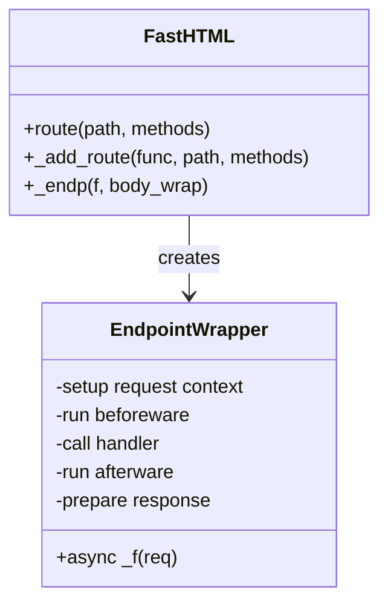
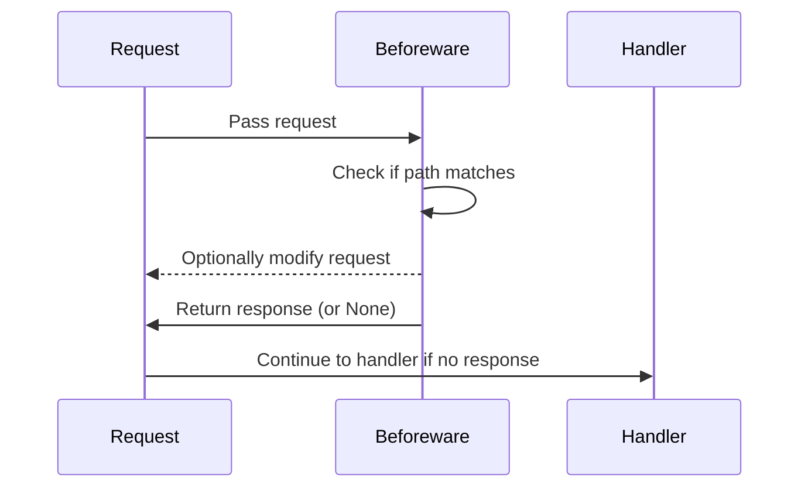
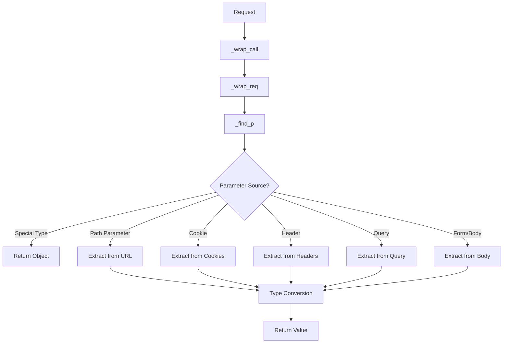
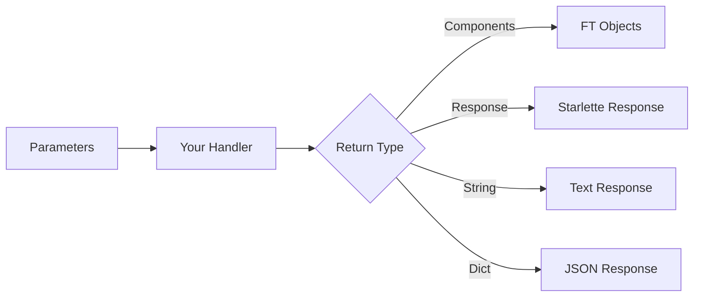
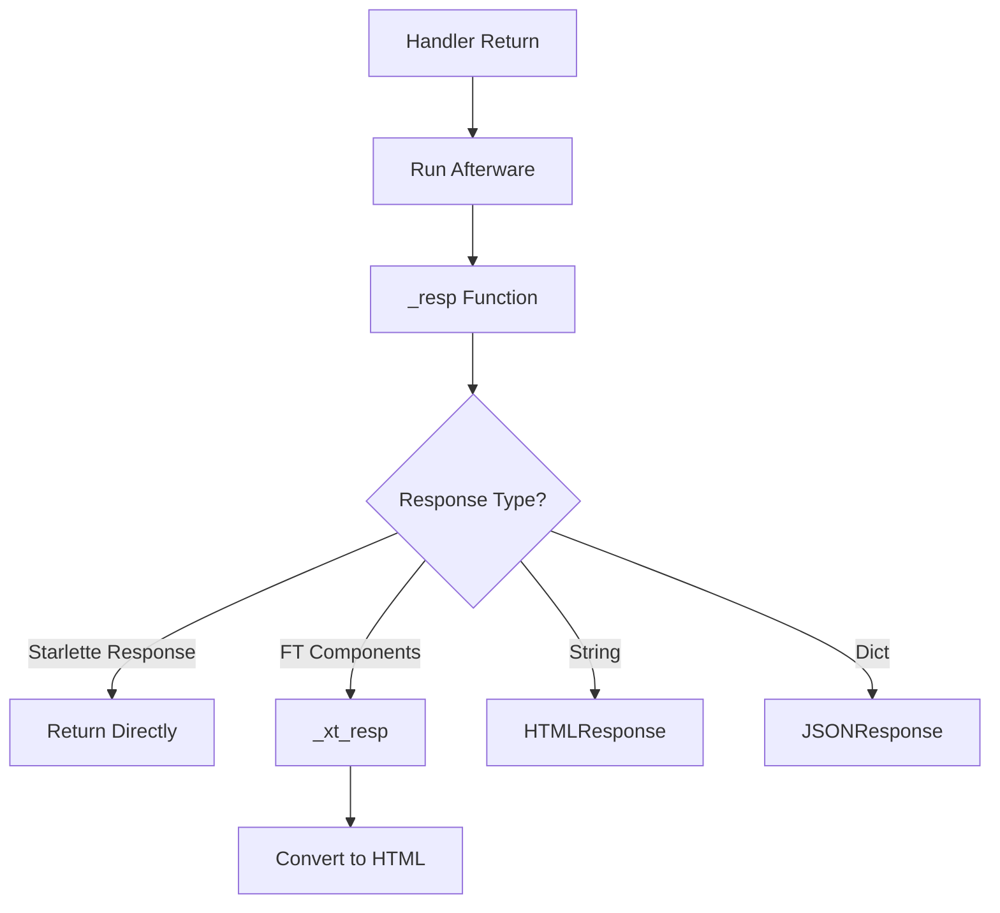
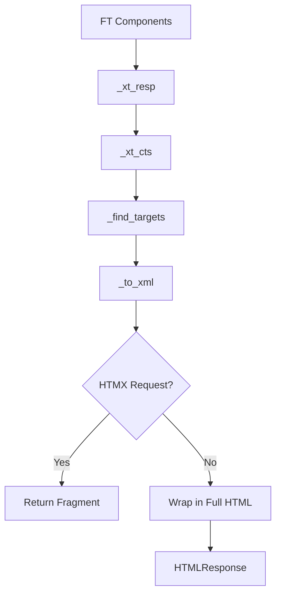
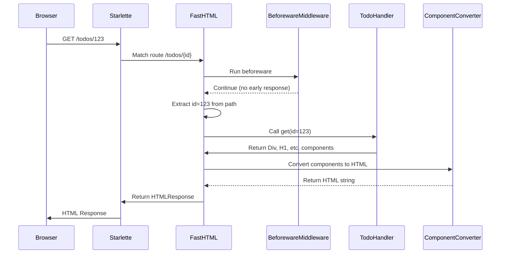

# FastHTML Request Flow

This document explains how requests flow through FastHTML, from the initial HTTP request to the final HTML response. Understanding this flow helps you grasp how FastHTML works under the hood and makes it easier to build and debug applications.

## Overview

FastHTML builds on top of Starlette's ASGI framework but adds powerful abstractions for parameter extraction, middleware, and component-based HTML generation.



## Detailed Request Flow

### 1. HTTP Request Arrival
**Code Reference:** `FastHTML class in core.py:514-547`

- A browser sends an HTTP request to your FastHTML application
- The request is received by the Starlette ASGI server
- The request contains a URL path, headers, query parameters, and possibly a body

**Code Explanation:**
The `FastHTML` class (core.py:514-547) initializes the application by setting up middleware, headers, footers, and exception handlers. It extends Starlette's base functionality and configures session handling, CORS, and other application-wide settings. This class serves as the entry point for handling all incoming HTTP requests.

### 2. Starlette Router Processing
**Code Reference:** `add_route in core.py:549-554` and `_add_route in core.py:622-626`

Starlette's router matches the incoming request to a registered route.



For example, if you have a route defined with `@rt("/todos/{id}")` and a request comes in for `/todos/123`, Starlette will:
- Match the route pattern
- Extract `id=123` as a path parameter
- Call the endpoint function (which is actually a FastHTML wrapper)

**Code Explanation:**
The `add_route` function (core.py:549-554) registers routes with the Starlette router. It normalizes HTTP methods to uppercase, removes any existing routes with the same path, name, and methods combination, and then appends the new route. The `_add_route` function (core.py:622-626) creates a Route object with the endpoint, path, methods, and name, calls add_route to register it, and returns a location function that can be used to generate URLs for this route.

### 3. FastHTML Endpoint Wrapper Execution
**Code Reference:** `_endp in core.py:560-581`

FastHTML wraps every route handler with its own function created by `_endp()`:



This wrapper initializes request-specific attributes, including:
- Headers (`req.hdrs`)
- Footers (`req.ftrs`)
- HTML attributes (`req.htmlkw`)
- Body attributes (`req.bodykw`)

**Code Explanation:**
The `_endp` function (core.py:560-581) creates a wrapper around handler functions. This wrapper sets up request context (headers, footers, HTML attributes), runs beforeware middleware, calls the handler with extracted parameters, processes the response through afterware, and prepares the final response. This function is crucial as it manages the entire request lifecycle, from preprocessing through middleware to final response generation.

### 4. Middleware/Beforeware Execution
**Code Reference:** `Beforeware class in core.py:221-222` and execution in `_endp in core.py:567-574`

Before calling your handler, FastHTML runs any registered beforeware:



Each beforeware can:
- Modify the request (e.g., add authentication info)
- Return an early response (e.g., redirect unauthenticated users)
- Let the request continue to the handler

**Code Explanation:**
The `Beforeware` class (core.py:221-222) defines a middleware component that can be skipped for certain paths. In `_endp` (core.py:567-574), each registered beforeware is executed, checking path exclusions and potentially modifying the request or returning an early response. Beforeware functions can intercept requests before they reach handlers, enabling authentication, logging, or other cross-cutting concerns.

### 5. Parameter Extraction
**Code Reference:** `_find_p in core.py:168-205`, `_wrap_req in core.py:207-208`, and `_wrap_call in core.py:433-435`

FastHTML uses type annotations to automatically extract and convert parameters:



For example, with a handler like `def get(id:int, user:User):`:
- `id` is extracted from the URL path and converted to an integer
- `user` is deserialized from the request body as a User object

**Code Explanation:**
The `_find_p` function (core.py:168-205) is the heart of FastHTML's parameter extraction system. It intelligently locates parameters from various sources based on type annotations. It first checks for special types like Request or Session, then searches through path parameters, cookies, headers, query parameters, and finally form/body data. The `_wrap_req` function (core.py:207-208) applies this extraction to all parameters, and `_wrap_call` (core.py:433-435) invokes the handler with these extracted parameters.

### 6. Handler Function Execution
**Code Reference:** `_handle in core.py:225-226` and handler call in `_endp in core.py:575`

Your handler function runs with the extracted parameters and returns components:



For example, a TodoApp handler might return:
```python
def get(id:int):
    return Div(
        H1("Todo #" + str(id)),
        P(todos[id].title),
        Button("Mark Done", id="done-btn")
    )
```

**Code Explanation:**
The `_handle` function (core.py:225-226) executes the handler function, supporting both synchronous and asynchronous handlers. It's called within `_endp` (core.py:575) after parameter extraction. This function handles the actual business logic execution, converting between sync/async contexts as needed. The handler receives extracted parameters and returns UI components or other response types.

### 7. Response Processing
**Code Reference:** `_resp in core.py:409-422`, afterware execution in `_endp in core.py:576-579`

The response passes through afterware and is processed based on its type:



**Code Explanation:**
The `_resp` function (core.py:409-422) converts the handler's return value into a proper Starlette response. It handles various return types: passing through Response objects, converting FT components to HTML via `_xt_resp`, wrapping strings in HTMLResponse, and dictionaries in JSONResponse. Afterware (processed in `_endp` core.py:576-579) can further modify the response before it's finalized. This flexibility allows handlers to return Python objects that are automatically converted to appropriate HTTP responses.

### 8. Component to HTML Conversion
**Code Reference:** `_xt_resp in core.py:402-403`, `_xt_cts in core.py:385-398`, `_find_targets in core.py:336-343`, and `_to_xml in core.py:351-354`

FastHTML components are converted to HTML:



The `_find_targets` step resolves route references, allowing you to write:
```python
A("Home", get="index")  # Becomes <a hx-get="/index">Home</a>
```

**Code Explanation:**
The `_xt_resp` function (core.py:402-403) wraps the component conversion process, returning an HTMLResponse. `_xt_cts` (core.py:385-398) handles background tasks, HTTP headers, and determines if a full HTML document is needed. `_find_targets` (core.py:336-343) processes route references in components, converting them to URLs, and `_to_xml` (core.py:351-354) converts components to HTML strings. Together, these functions transform declarative Python components into HTML markup, with special handling for HTMX partial requests.

### 9. Final Response Construction
**Code Reference:** `respond in core.py:376-382` and `_xt_resp in core.py:402-403`

The HTML response is constructed with:
- The generated HTML content
- Appropriate headers (including HTMX headers if needed)
- Status code
- Any background tasks to be executed after the response is sent

**Code Explanation:**
The `respond` function (core.py:376-382) constructs the HTML document structure with heads, body content, and appropriate attributes. It applies the body_wrap function to transform content if needed. The `_xt_resp` function (core.py:402-403) creates the final HTMLResponse with the converted content, headers, and background tasks. This construction ensures proper HTML document structure while supporting partial updates for HTMX requests.

### 10. Response Delivery
**Code Reference:** Handled by Starlette's ASGI server after creation of the response in `_xt_resp in core.py:402-403`

The response is sent back through the Starlette ASGI server to the browser.

## Example: Complete Request Flow

Here's a complete example of a request flow for a simple todo app:



## Key Innovations

What makes FastHTML special:

1. **Type-Based Parameter Extraction**: Use Python type annotations to get parameters from various sources
2. **Component-Based Responses**: Return Python objects that become HTML elements
3. **Middleware Hooks**: Beforeware/afterware for cross-cutting concerns
4. **Transparent HTMX Integration**: Special handling for HTMX partial requests
5. **Clean Route Definitions**: Routes with Python function signatures that clearly show expected parameters

This architecture creates a developer experience that's both intuitive (Python objects represent UI components) and type-safe (parameters are automatically extracted and converted to the right types).